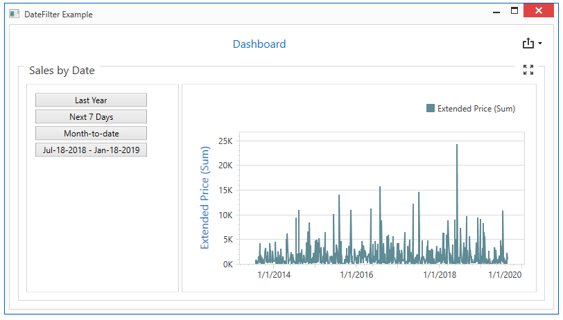

<!-- default badges list -->

<!-- default badges end -->
<!-- default file list -->
*Files to look at*:

* [MainWindow.xaml](./CS/WpfDateFilterDashboardItemSample/MainWindow.xaml) (VB: [MainWindow.xaml](./VB/WpfDateFilterDashboardItemSample/MainWindow.xaml))
* [MainWindow.xaml.cs](./CS/WpfDateFilterDashboardItemSample/MainWindow.xaml.cs) (VB: [MainWindow.xaml.vb](./VB/WpfDateFilterDashboardItemSample/MainWindow.xaml.vb))
<!-- default file list end -->

# How to Create a Dashboard with DateFilterDashboardItem in Code

This example creates a dashboard in code and displays it in the Dashboard control. The dashboard contains a DateFilter and a Chart items placed in a Group item. The dashboard is bound to an Excel data source. The layout is constructed in code.

## API

* [DateFilterDashboardItem](https://docs.devexpress.com/Dashboard/DevExpress.DashboardCommon.DateFilterDashboardItem?v=19.1) class
* [ChartDashboardItem](https://docs.devexpress.com/Dashboard/DevExpress.DashboardCommon.ChartDashboardItem) class
* [DashboardItemGroup](https://docs.devexpress.com/Dashboard/DevExpress.DashboardCommon.DashboardItemGroup) class
* [DashboardExcelDataSource](https://docs.devexpress.com/Dashboard/DevExpress.DashboardCommon.DashboardExcelDataSource) class
* [DashboardLayoutItem](https://docs.devexpress.com/Dashboard/DevExpress.DashboardCommon.DashboardLayoutItem) class
* [DashboardLayoutGroup](https://docs.devexpress.com/Dashboard/DevExpress.DashboardCommon.DashboardLayoutGroup) class
* [Dashboard.LayoutRoot](https://docs.devexpress.com/Dashboard/DevExpress.DashboardCommon.Dashboard.LayoutRoot) property
* [DashboardControl](https://docs.devexpress.com/Dashboard/DevExpress.DashboardWpf.DashboardControl) class

## Documentation

* [WPF Viewer](https://docs.devexpress.com/Dashboard/119813)
* [Create Dashboards in the Visual Studio Designer](https://docs.devexpress.com/Dashboard/17519)
* [Dashboard Layout](https://docs.devexpress.com/Dashboard/116693)
